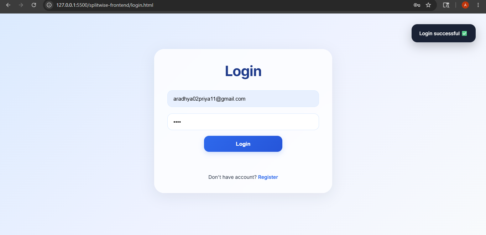
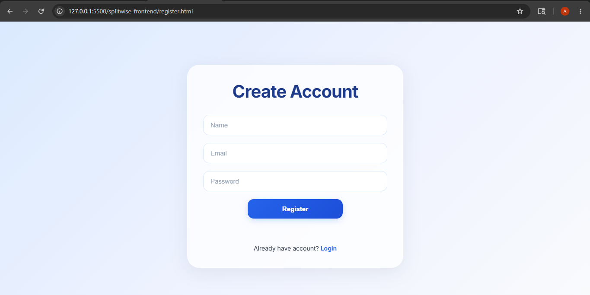
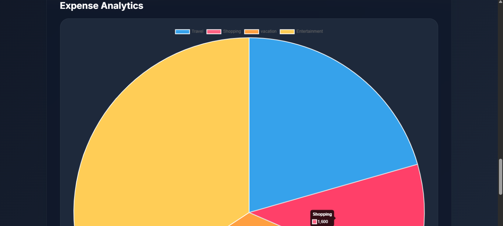
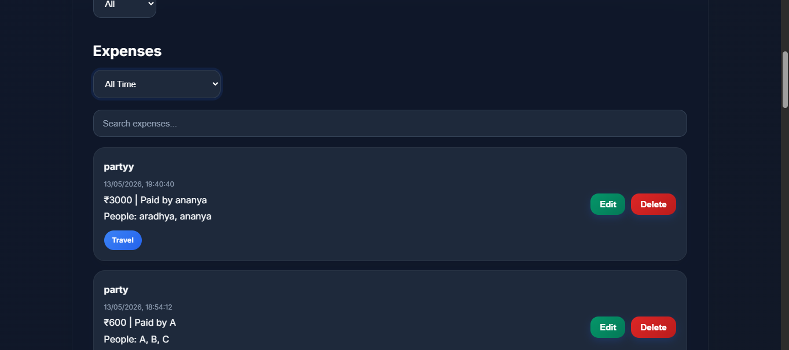
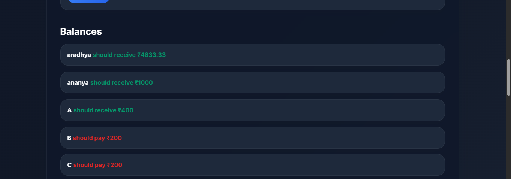
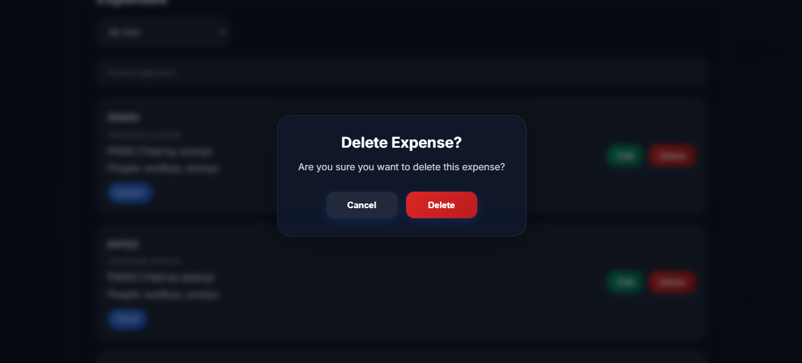
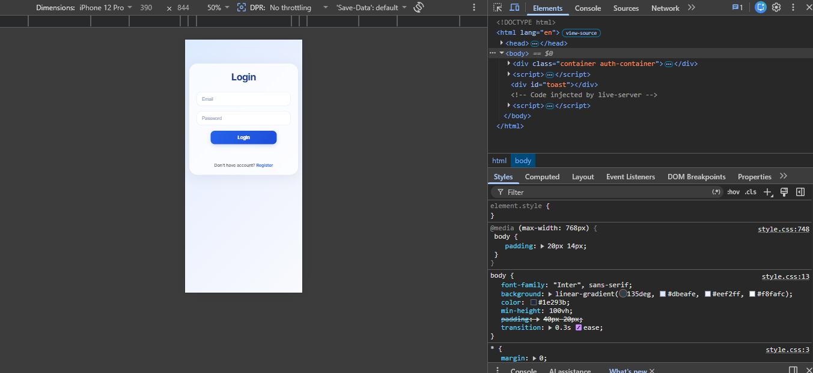
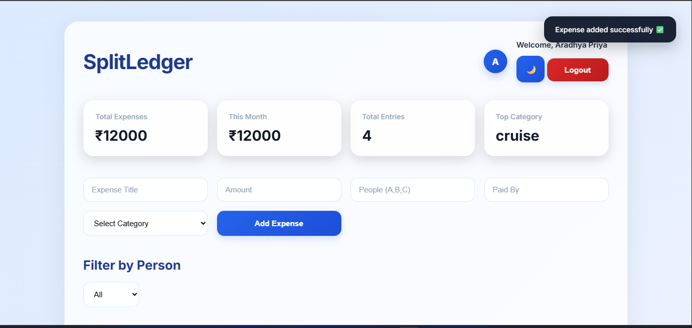
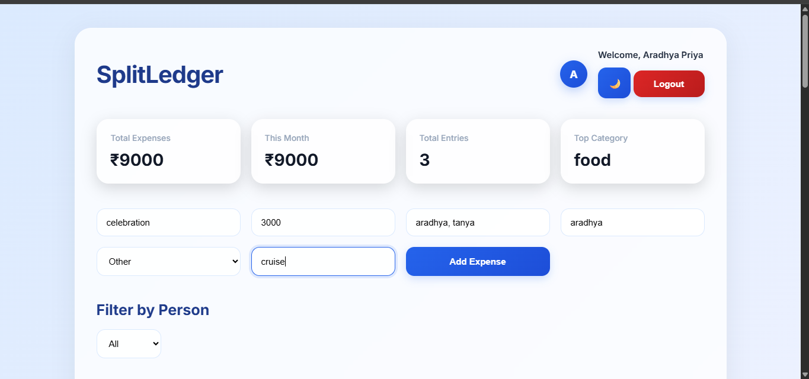

# SplitLedger

SplitLedger is a full-stack expense management and expense splitting web application built to simplify tracking shared expenses between friends, roommates, or groups. The application allows users to securely manage expenses, view balances, analyze spending patterns, and track transactions through a clean and responsive dashboard.

---

## Live Demo

https://splitledger-app.netlify.app/login.html


## Introduction

This project was built as a learning-focused full-stack application to strengthen concepts of frontend-backend integration, authentication, responsive UI design, and database management.


## Features

- Secure Login & Registration using JWT Authentication
- User-specific expense management
- Add, edit, and delete expenses
- Expense categorization
- Search and filtering functionality
- Date-wise expense filtering
- Settlement and balance calculation
- Interactive analytics chart
- Dashboard summary cards
- Dark mode support
- Real-time form validation
- Toast notifications and custom modals
- Responsive design for mobile and desktop

---

## Tech Stack

### Frontend
- HTML
- CSS
- JavaScript

### Backend
- Node.js
- Express.js

### Database
- MongoDB

### Authentication
- JWT Authentication

---

## Project Structure

```bash
splitledger/

├── splitwise-backend/
│   ├── controllers/
│   ├── middleware/
│   ├── models/
│   ├── routes/
│   ├── data/
│   ├── server.js
│   └── package.json
│
├── splitwise-frontend/
│   ├── css/
│   ├── js/
│   ├── index.html
│   ├── login.html
│   └── register.html
│
├── screenshots/
│
└── README.md
```

---

## Screenshots


## Login Page



---

## Register Page



---

## Dashboard - Light Mode


---

## Dashboard - Dark Mode


---

## Expense Analytics



---

## Filters & Search



---

## Expense Balances



---

## Delete Expense



---

## Mobile View



---

## Toast Notifications



---

## Customization Options




## How to Run the Project

### Clone Repository

```bash
git clone https://github.com/Aradhya49/SplitLedger.git
```

---

### Backend Setup

```bash
cd splitwise-backend
npm install
npm start
```

---

### Frontend Setup

Open `index.html` using Live Server or any local server extension.

---

## Future Improvements

- Group expense management
- PDF/CSV export
- Budget tracking
- Recurring expenses
- Email notifications

---

## Learning Outcomes

This project helped me understand full-stack development concepts including authentication, REST APIs, MongoDB integration, responsive UI design, and frontend-backend communication.


## Author

Aradhya Priya